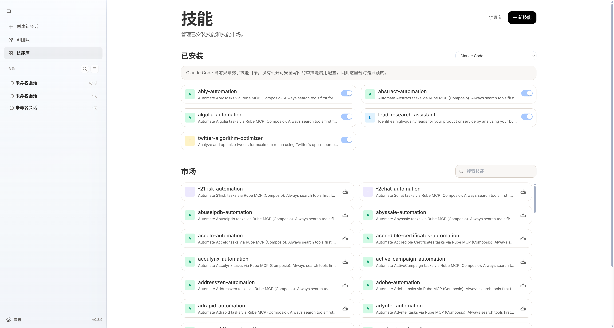
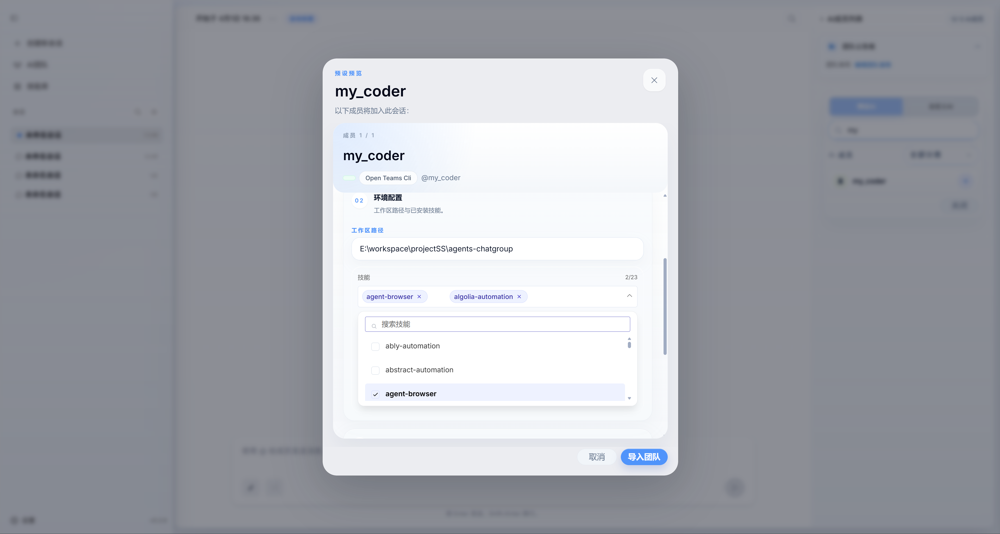

## 什么是技能
每一个技能都封装了一类具体能力，例如代码生成、信息检索、数据处理、文件操作或调用外部 API。
技能通常包含明确的输入输出定义、执行逻辑以及与环境交互的方式，使智能体能够在不同场景下稳定地调用和复用这些能力。

通过为智能体配置不同的技能，可以灵活地定义其“能做什么”和“如何做”。
多个技能可以组合使用，形成更复杂的工作流程，从而支持跨任务、多步骤的问题解决。

## 安装技能
openteams中提供了技能库，您可以在软件中为你的Agent代理安装技能，软件也会读取当前代理已安装的技能列表。
在市场技能列表中搜索您想要安装的技能，选择要安装的Agent代理，点击安装即可。
<video src="../../images/zh/install_skill.mp4" autoPlay loop muted playsInline />

## Agent代理层面开启技能
在已安装技能列表中为Agent代理开启技能（部分Agent自身不支持开关技能，如ClaudeCode）

## 赋予AI成员技能
需要给团队中的AI成员配置对应的技能后，成员才允许使用此技能。可以在成员属性配置中的技能列表中选择已安装的技能赋予成员。
